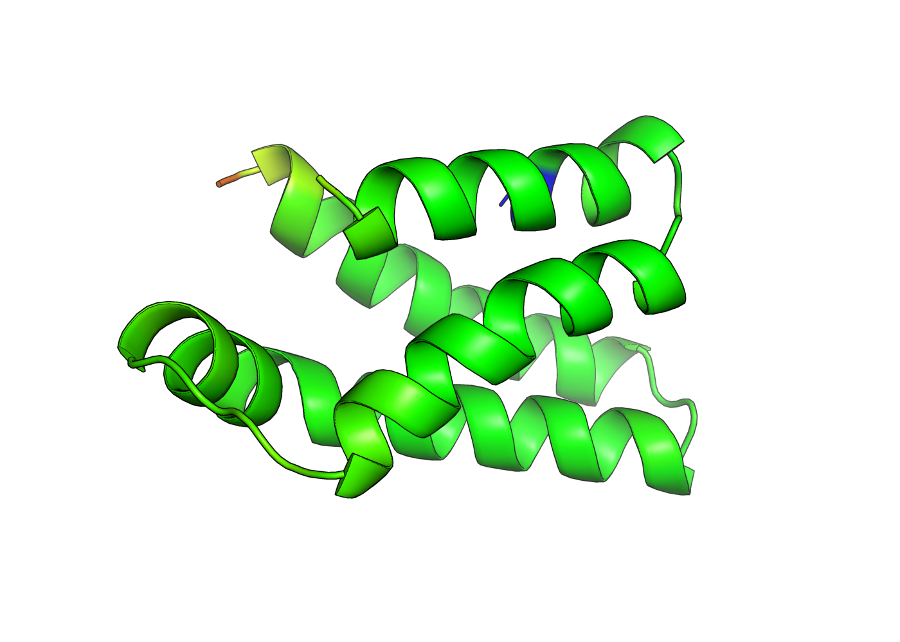
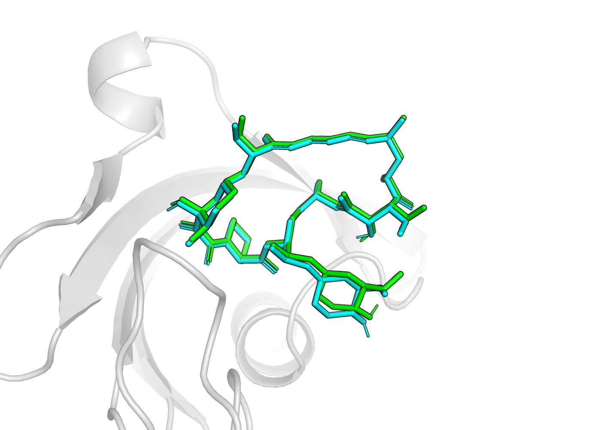
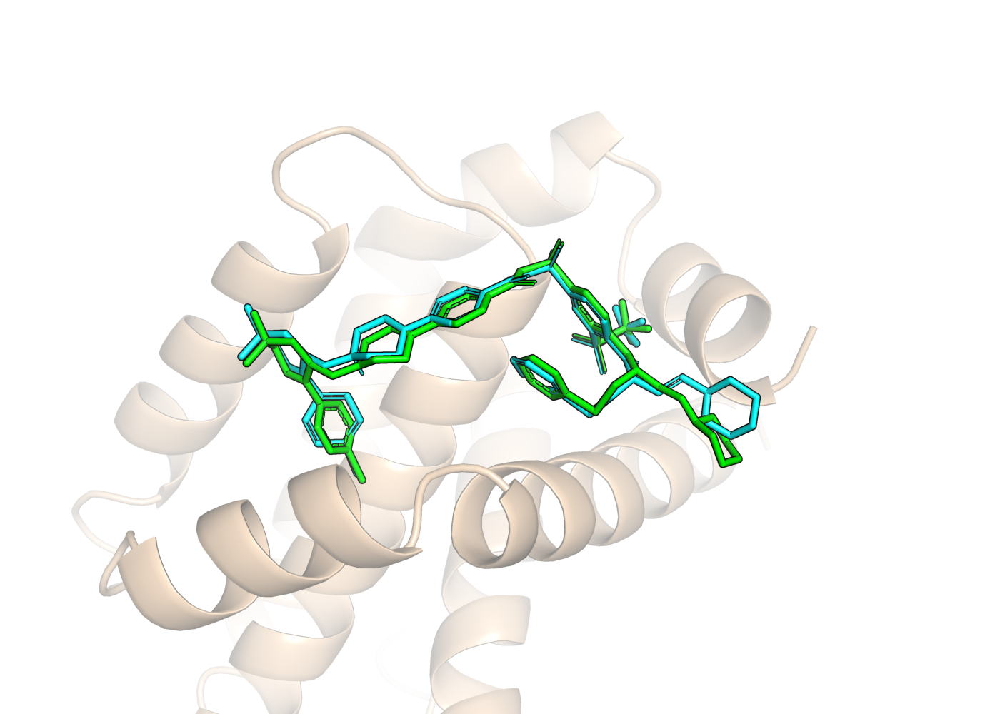

# foldock

A small, reproducible **structure-based drug–target docking and validation** pipeline:
**AlphaFold2 structure prediction → binding-pocket docking (AutoDock Vina) → redocking RMSD validation.**

Everything here runs on a laptop (built and tested on Apple Silicon, CPU-only) with free, open tools — no GPU and no cloud required.

## Why redocking validation matters

It is easy to dock a molecule into a protein and get a number. It is much harder to show that number is *trustworthy*. The standard test is **redocking**: take a crystal structure with a ligand already bound, remove the ligand, dock it back, and measure how close the docked pose is to the experimental one (RMSD). **Under ~2 Å is considered a successful reproduction** of the experimental binding mode. This repo automates that test.

## Results

Two clinically important compounds, each redocked into its target:

| Compound | Target | Binding affinity | Redock RMSD | PDB |
|---|---|---|---|---|
| Rapamycin (sirolimus) | FKBP12 | **−11.09 kcal/mol** | **0.53 Å** | 1FKB |
| Navitoclax (ABT-263)  | Bcl-xL | **−10.56 kcal/mol** | **0.90 Å** | 4QNQ |

Both redock RMSDs are well under the 2 Å threshold — the pipeline reproduces known binding modes, so its affinity estimates are credible.

Plus a structure-prediction sanity check — the rapamycin-binding **FRB domain of mTOR** folded with AlphaFold2 (LocalColabFold), **mean pLDDT 92.8** (highest-confidence tier), the binding-anchor residue at pLDDT 94.

### Figures

| mTOR FRB fold (pLDDT) | Rapamycin → FKBP12 | Navitoclax → Bcl-xL |
|---|---|---|
|  |  |  |

In the docking panels, **green = experimental (crystal) pose, cyan = docked pose** — the near-perfect overlap is the sub-1 Å validation, visualised.

## Usage

```bash
# fetch a holo structure, then redock its native ligand:
curl -O https://files.rcsb.org/download/1FKB.pdb
scripts/redock.sh 1FKB.pdb RAP A FKBP12_RAPA
```

Output: binding affinity (kcal/mol) and redock RMSD vs the crystal pose.

## Stack

- **Structure prediction:** AlphaFold2 via [LocalColabFold](https://github.com/YoshitakaMo/localcolabfold)
- **Docking:** [AutoDock Vina](https://github.com/ccsb-scripps/AutoDock-Vina) 1.2.x
- **Cheminformatics:** RDKit, Meeko, Open Babel
- **Rendering:** PyMOL (open source)

See [SETUP.md](SETUP.md) for installation.

## License

MIT
